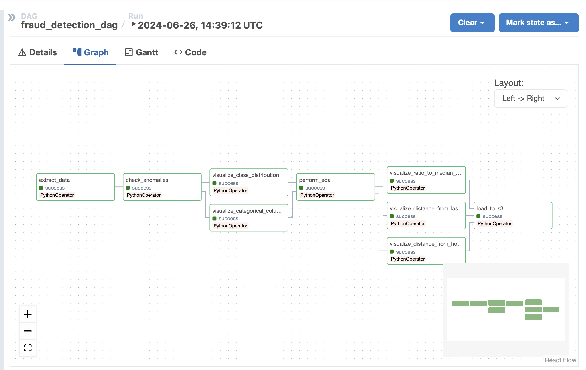

# Airflow Data Pipeline

This repository contains an Apache Airflow data pipeline for a credit card fraud detection project. The pipeline extracts data from an S3 bucket, performs exploratory data analysis (EDA), creates visualizations, and loads the results back to S3.

## Getting Started

To get started with this project, follow the steps below:

### 1. Environment Setup

Create a `.env` file in the project's config directory with the following environment variables:

```dotenv
AWS_ACCESS_KEY_ID=your_aws_access_key_id
AWS_SECRET_ACCESS_KEY=your_aws_secret_access_key
AWS_REGION=your_aws_region
```

### 2. Running the Project

Start the project using Docker Compose:

```bash
docker-compose up
```

## Components



### 1. Extract Data

The `extract_data.py` script extracts data from an S3 bucket and passes it to the next task.

### 2. Check Anomalies

The `check_anomalies.py` script analyzes the extracted data for any anomalies outside of the expected data distribution.

### 3. Perform EDA

The `perform_eda.py` script performs exploratory data analysis on the extracted data and pushes the EDA results to XCom.

### 4. Create Visualizations

The `visualizations` folder has various scripts that generates visualizations like data distribution, certain ratios across categories, etc. to XCom

### 5. Load to S3

The `load_to_s3.py` script loads various data files, tables, visualizations, and EDA results to S3.

## Folder Structure

```
.
├── config/
│   └── .env
|   └── s3_config.yaml
├── dags/
│   └── operators/
│       └── visualizations/
│           └── visualize_categorical_columns.py
│           └── visualize_class_distribution.py
│           └── visualize_distance_from_home.py
│           └── visualize_distance_from_last_transaction.py
│           └── visualize_ratio_to_median_purchase_price.py
│       ├── check_anomalies.py
│       ├── extract_data.py
│       ├── perform_eda.py
│       └── load_to_s3.py
|   ├── fraud_detection_dag.py
├── images/
│   └── Airflow_DAG.png
├── Dockerfile
├── docker-compose.yaml
├── requirements.txt
└── README.md

```
